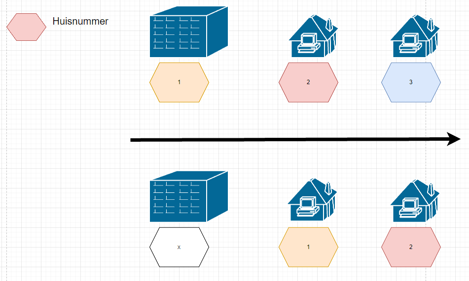

# Readdress test scenario's

### 1. Given Destination Address Does Not Exist

The destination house number does not exist, then a new address with that house number will be proposed.

### 2. Given Destination Address Exists

#### 2.1 Active (proposed or current)

Readdress to existing address.

#### 2.2 Not Active (rejected, retired or removed)

Propose new address and readdress.

### 3. Given Source Address Has Box Number

#### 3.1 When destination-address has no box numbers

Then the source-address box numbers are proposed.

#### 3.2 When destination-address already has this box number 
Then the attributes of the source-address box number get copied on the existing destination-address box number while mainting its original identifier ie. readdressing.

#### 3.3 When destination-address has its own boxnumber 
Then it is rejected or retired depending on its status.
